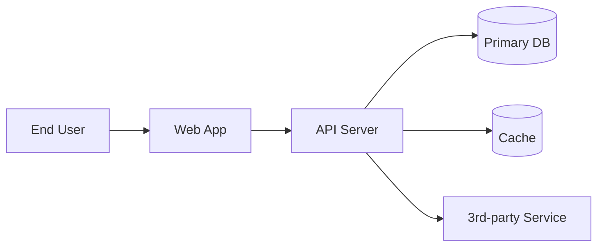

# Architecture Document Body Template (architecture.md + architecture_delta.md)

**配套**：`skills/architecture-write/SKILL.md` §4 Doc Output Contract + §5 4-Step Standard Procedure。

本 reference 是 Stage 3 Architecture 阶段两份增量类 doc 的章节级模板：项目级单文件 `docs/architecture/architecture.md`（必备）+ per-release `docs/release<x.y>/architecture_delta.md`（仅本 release 引入架构变化时必备）。delta vs 主 doc 决策见 `delta-policy.md`。完整 frontmatter schema 见 `skills/doc-guardian/references/frontmatter-schema.md`。

---

## 1. Architecture 主文档（`docs/architecture/architecture.md`）

### 1.1 章节顺序与必含内容

```markdown
---
<frontmatter, 见 skills/doc-guardian/references/frontmatter-schema.md §3.1; 不携带 release 字段（项目级 doc）>
---

# <Project Name> Architecture

## 1. Overview

### 1.1 Purpose & Scope
- **One-paragraph architecture pitch**: <这是怎样的系统？谁在跑？为谁服务？>
- **In scope**: <本架构 doc 覆盖的系统边界>
- **Out of scope**: <显式不覆盖的部分；与上游 PRD §6 / SRS §5 一致>

### 1.2 Architectural Style & Major Decisions
- **Architecture style**: <e.g. layered monolith / modular monolith / microservices / event-driven / serverless>
- **Key technical choices**: <语言 / framework / 主数据库 / 消息总线 等大类决策>
- **Decision drivers**: <quality attributes 优先级，e.g. throughput > latency > cost>

### 1.3 Glossary (Architecture-level)
组件 / 接口 / 服务 / 端点 等术语在此首现处定义；与 SRS / PRD 术语互斥时显式标。

## 2. System Context

### 2.1 External Actors
- 外部用户（end-user / admin / partner system）
- 上下游系统（third-party APIs / data sources / downstream consumers）

### 2.2 Context Diagram
推荐 mermaid 或 ASCII：



## 3. Component Catalog

按 component 列出，每个一节：

### 3.1 Component A — <name>
- **Responsibility**: <单一职责描述，1-2 句>
- **Technology**: <语言 / framework / 关键库>
- **Inputs**: <从哪些 component 接收什么>
- **Outputs**: <向哪些 component 输出什么>
- **Persistence**: <是否拥有数据；schema 链接 §6>
- **Scaling characteristics**: <stateless / stateful / shardable / 单实例>
- **Failure mode**: <宕机 / 慢响应 / 数据损坏 时的预期行为>

### 3.2 Component B ...

## 4. Interfaces & Contracts

### 4.1 External APIs
对外暴露的 API：endpoint / method / auth / 错误码大类。详细 schema 链 SRS §4.1。

### 4.2 Inter-Component Contracts (内部接口)
按对列出（A → B / B → C 等）：interface kind (REST / gRPC / event / shared DB) + 关键 schema + failure mode + versioning policy。

### 4.3 Cross-Cutting Concerns
认证 / 授权 / 审计日志 / metrics / tracing / config — 跨 component 通用约定。

## 5. Data Flows

### 5.1 Key Use Case Flows
按 SRS §3 (P0 stories) 顺序，给每个关键用例的端到端数据流（component 调用顺序 + 数据 transform 节点 + 持久化点）。

### 5.2 Bulk / Batch Flows
如有定时任务 / batch 数据处理：触发源 + 频率 + component 链 + 失败重试策略。

### 5.3 Event-Driven Flows
如有 event bus：event 名 + producer / consumer + ordering / dedup 保证。

## 6. Data Model

### 6.1 Primary Entities
关键 entity 的逻辑模型（fields / types / relationships）；避免与 SRS §4.3 重复，可用引用："详见 SRS §4.3 Data Models"。

### 6.2 Storage Decisions
每个数据集的 storage 选型 + 一致性级别 + retention policy。

### 6.3 Migration Strategy
如有 schema migration：流程 + 兼容 / 破坏判定 + rollback。

## 7. Deployment Topology

### 7.1 Runtime Topology
component → 物理 / 逻辑 部署单元（容器 / VM / serverless function）映射；含数量 / 实例 sizing 假设。

### 7.2 Network Topology
跨组件 / 跨网络的连接 / 防火墙 / DNS / 负载均衡。

### 7.3 Environment Strategy
dev / staging / prod 之间的差异（typically scaling factors / 数据规模 / 第三方 endpoint）。

## 8. Operational Characteristics

### 8.1 Availability & Reliability
SLO / failover / multi-region 假设 + 故障检测 / 恢复路径。

### 8.2 Observability
metrics / logs / traces 大类约定 + alert 触发条件。

### 8.3 Security Posture
认证策略 / 数据加密 / secrets management / vulnerability scanning 大类。

### 8.4 Cost Posture (Optional)
关键 cost driver；为 architecture decision 提供权衡视角。

## 9. Architectural Decisions Records (ADR-Style)

记录 architecture-level **关键** 决策（不写所有；只写"如果以后想改可能要重做"的）。

### 9.1 ADR-001: <decision title>
- **Status**: accepted / superseded
- **Context**: <什么让我们要决策；约束是什么>
- **Decision**: <决定做什么>
- **Rationale**: <为什么这个选项；其他选项各自的痛点>
- **Consequences**: <这选择带来什么 long-term implications>
- **Alternatives considered**: <未选项目 + 拒绝原因>

### 9.2 ADR-002: ...

## 10. Open Questions

未解决的架构议题（可能进 future release / 由 architecture-review 把关 / 由 development 阶段实证）。

## Pending Changes

<!--
本节存放本次 write/revise 周期的改动条目；changelog.py promote 后转入 Change Log。
单条格式：
- <YYYY-MM-DDTHH:MM:SSZ> [Section <n>]: <语义化摘要>
事实源 skills/doc-guardian/references/change-log-format.md §2.2。
-->

## Change Log

<!--
按日期分组（### YYYY-MM-DD），同日内 entry 时间升序，不同日期组按日期降序。
事实源 skills/doc-guardian/references/change-log-format.md §3.1。
-->
```

### 1.2 章节级写作准则

- **§1.2 Architecture Style**：用业界已知的 style 名（"modular monolith" / "microservices" / "event-driven"）；自创术语会让 architecture-review 维度 4 medium。
- **§3 Component Catalog**：每个 component 必含 7 子项；不写 7 子项的 component 视为骨架不完整（维度 1 blocking）。
- **§4 Interfaces**：与 SRS §4 互补——SRS 是 contract（功能视角），Architecture 是 implementation contract（结构视角）；允许互相引用，但 architecture 应能独立成立。
- **§5 Data Flows**：每个 P0 use case 至少 1 张图或步骤序列；图越具体越好。
- **§7 Deployment**：哪怕单进程 monolith 也要写 §7.1 runtime topology（说明就是 1 个进程 / 1 台机即可）；避免 architecture-review 维度 1 blocking。
- **§9 ADR**：选 3-7 条最重要的；少于 3 条说明决策没记录，多于 10 条说明把不重要决策也写了。

### 1.3 长度建议

- 总长 1500-4000 行（含 mermaid 标记）；S1 / S3 首 release 通常 2000-3000 行。
- 短于 800 行说明 component / data flow / deployment 信息密度太低。

---

## 2. Architecture Delta（`docs/release<x.y>/architecture_delta.md`，仅本 release 改架构时）

### 2.1 章节顺序

```markdown
---
type: architecture-delta
release: "<x.y>"
parent_architecture: docs/architecture/architecture.md
<其他 universal 字段>
---

# Release <x.y> Architecture Delta

## 1. Release Context

- **Triggered by**: <SRS architecture_change=true 的具体改动 / consumed BUG-NNN 引发 / 用户提的新需求>
- **Decision summary**: <一段话回答：本 release 改了什么架构？>

## 2. Inventory of Changes

按 architecture.md 章节顺序列出本 release 增量：

### 2.1 §3 Component Catalog Changes
- **Added**: <新组件列表>
- **Removed**: <删除组件列表>
- **Modified**: <修改组件 + 修改维度（responsibility / inputs / outputs / scaling / failure mode）>

### 2.2 §4 Interface Changes
- **Added APIs / contracts**: ...
- **Modified APIs / contracts (with backward-compat assessment)**: ...
- **Deprecated APIs**: ...

### 2.3 §5 Data Flow Changes
- **Added flows**: ...
- **Modified flows**: ...

### 2.4 §6 Data Model Changes
- **Schema additions / migrations**: ...
- **Data model implications**: ...

### 2.5 §7 Deployment Changes
- **Runtime topology**: ...
- **Network topology**: ...

## 3. Long-Term Fact Sync (delta-policy 决策记录)

按 `delta-policy.md` §决策树：本 release 哪些改动是 **长期事实**（本 doc + architecture.md 同步改）vs **本 release 局部**（仅本 doc）：

| Change | Long-term fact? | Synced to architecture.md? | Notes |
|--------|-----------------|----------------------------|-------|
| 新组件 X | yes | yes — architecture.md §3.<n> 已加 | 下个 release 起点应包含 X |
| API path 重命名 | yes | yes — architecture.md §4.<n> 已改 | breaking change；客户端必须升级 |
| 临时 sharding 方案 | no | no | 仅本 release scope；下次 release 可能 revert |

## 4. Migration & Rollback

- **Migration plan**: <如有 schema / config / API 迁移：步骤 + 顺序 + 兼容期>
- **Rollback strategy**: <本 release 失败时的回滚路径；与主 doc §6.3 Migration Strategy 互校>

## 5. Bug Flow Linkage (root_cause==architecture 时)

如果本 delta 由 BUG-NNN 触发：

- **Triggered by**: BUG-NNN.md
- **Section affected**: <which §2.x 的 component / interface / data flow 被 bug 触发改动>
- **Long-term fact assessment**: <该改动是否 long-term；典型 architecture bug 大概率是 long-term，应同步主 doc>

## Pending Changes
## Change Log
```

### 2.2 写作准则

- **§1 Release Context**：必须 explicit 说出"为什么这个 release 引入这种架构改动"；避免空泛 "improvements"。
- **§2 Inventory**：按 architecture.md 章节顺序对应；缺章节直接说明"§<n> no change in this release"。
- **§3 Long-Term Fact Sync 表**：是 architecture-review 维度 6 的关键证据；每行必填 Long-term fact? + Synced 列。
- **§4 Migration & Rollback**：S2-x release 必填；S1 / S3 首 release 此节可写 "N/A — first release"。
- **§5 Bug Flow Linkage**：仅 Bug Flow re-entry 时启用。

### 2.3 frontmatter 关键字段

| 字段 | 必填 | 注 |
|------|------|----|
| `parent_architecture` | ✓ | 固定为 `docs/architecture/architecture.md`；validate.py 类 5 cross-ref |
| `release` | ✓ | == progress.md.release（同一 release）|

---

## 3. Common Pitfalls

| Pitfall | 后果 | 改正 |
|---------|------|------|
| §3 component 不写 Responsibility / Failure mode | 维度 1 blocking | 每个 component 必含 7 子项 |
| §4 inter-component contract 缺 versioning | 维度 3 可决策性 blocking | 加 versioning policy |
| §7 单进程 monolith 不写 runtime topology | 维度 1 blocking | 哪怕 "1 process / 1 machine" 也要写 |
| 改架构但未创 architecture_delta | required-artifacts.md DSL（`architecture_change: true`）触发 P6 dim A reject | 创 delta 或改 SRS frontmatter `architecture_change: false` |
| 创了 delta 但 SRS frontmatter `architecture_change: false` | DSL 推导 delta 非必备；但 delta 存在；validate.py 类 1 路径 OK 但语义可疑 | 删 delta 或改 SRS frontmatter |
| 长期事实仅写 delta，不同步主 doc | 维度 6 blocking；下个 release 起点错误 | 按 `delta-policy.md` 同步两份 doc |
| delta `parent_architecture` 路径不存在 | validate.py 类 5 拒绝 | frontmatter 必填正确路径 |
| 跨 release 改历史 release 目录下的 architecture_delta | release close 后该目录只读 | 不可改；新 release 写新 delta |
| Pending Changes 写完没 promote | validate.py 类 6 拒绝 | 跑 changelog.py promote |

---

## 4. 演化

- 修改本模板必须在 SKILL.md §10 References 节同步说明
- 增加新章节 / 字段需走 design proposal review cycle
- 当前对应 design proposal 版本：v0.5（2026-05-06）+ Phase 7 polish
