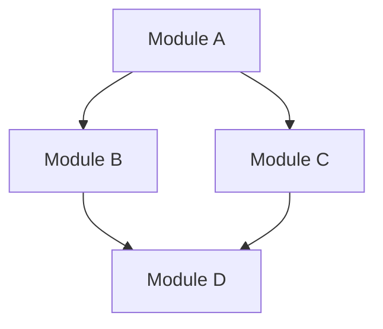

# SRS Document Body Template (SRS + Acceptance Plan + Integration Plan)

**配套**：`skills/srs-write/SKILL.md` §4 Doc Output Contract + §6 4-Step Standard Procedure。

本 reference 是 Stage 2 SRS 阶段三个增量类 doc 的章节级模板：SRS 主文档（必备）、Acceptance Plan（必备）、Integration Plan（多模块时必备）。S3 场景 source-system-analysis 4 个 snapshot 类 doc 的章节模板由 `skills/srs-write/SKILL.md` §4.2 直接给出，本文不重复（注：如果将来 source-system-analysis 模板复杂度增长，可以单独拆出 `references/source-system-analysis-template.md`）。完整 frontmatter schema 见 `skills/doc-guardian/references/frontmatter-schema.md`。

---

## 1. SRS 主文档（`docs/release<x.y>/srs/srs.md`）

### 1.1 章节顺序与必含内容

```markdown
---
<frontmatter, 见 skills/doc-guardian/references/frontmatter-schema.md §3.2 — 必含 release / is_multi_module / architecture_change>
---

# <Project Name> v<x.y> SRS

## 1. Introduction

### 1.1 Release Scope
- **Release version**: <x.y>
- **Scenario**: <S1 / S2-1 / S2-2 / S2-3 / S3>
- **Inherited PRD**: docs/prd/prd.md (project-level)
- **Source-system-analysis (S3 only)**: link to per-release supporting docs

### 1.2 What's New / Changed (S2-x only)
本 release 相对前一 release 的需求增量摘要；与 PRD §6 Boundary 一致。

### 1.3 Glossary
首现术语在此定义；与 PRD glossary 互斥时显式标 "本 SRS 范围内 X 指 Y"。

## 2. Functional Requirements

按 module 分组（多模块时 §2.1 / §2.2 ... 各 module 一节；单模块直接列）：

### 2.1 Module A

#### 2.1.1 Capability A1 — <descriptive name>
- **Source**: PRD §<n> (Capability) / CR-NNN
- **Description**: <一段功能描述>
- **Inputs**: <输入数据 / API parameter / event>
- **Outputs**: <输出数据 / API response / event>
- **Pre-conditions**: <前置约束>
- **Post-conditions / Invariants**: <事后约束>
- **Error / Edge cases**: <典型错误场景；至少 2 条>
- **Acceptance Criteria reference**: → `acceptance_plan.md §<x>`

#### 2.1.2 Capability A2 ...

### 2.2 Module B (多模块时)
...

## 3. Non-Functional Requirements

NFR 必须**量化**（PRD §5 仅给方向；本节给数值）：

| Category | Requirement | Threshold | Measurement |
|----------|-------------|-----------|-------------|
| Performance | API p95 latency | ≤ 200ms | Stage 5 testing 跑 load test |
| Scalability | Throughput | ≥ 1000 req/s | Stage 5 testing |
| Availability | Uptime SLO | ≥ 99.5% | post-deployment monitoring |
| Security | Auth | OAuth2 + JWT | Stage 5 integration test |
| Compatibility | Browser | Chrome ≥ 100, Safari ≥ 15 | Stage 5 cross-browser test |
| ... | ... | ... | ... |

## 4. Interface Contracts

### 4.1 External APIs
对外暴露 API（typically REST / gRPC）的签名 + 行为契约。建议每个 endpoint 一个子节。

### 4.2 Module Boundaries (多模块时)
模块间接口（API / event / shared data store）；详细集成时序在 Integration Plan。

### 4.3 Data Models
关键 entity 的 schema（field / type / constraint）；可链接到 architecture.md 实现细节。

## 5. Constraints & Assumptions

- **Inherited from PRD §7**: <列举 PRD 已声明的 constraint>
- **SRS-level constraints**: <SRS 引入的额外约束>
- **External dependencies (SRS-level)**: <第三方 API / 数据源 / 上游系统>

## 6. Consumed Bug Fixes (S2-x only; v0.6 round 1 H2)

本 release 通过 release-start 消费的 unresolved bugs（事实源：`docs/bug/BUG-*.md` 中 `consumed_in_release == <本 release>` 的列表）：

| BUG ID | root_cause | 本 SRS 中的修复需求 | 关联 Acceptance Criteria |
|--------|-----------|--------------------|------------------------|
| BUG-005 | null (post-close intake default) | <本 SRS 加的 functional req / acceptance criterion> | acceptance_plan.md §<x> |
| BUG-007 | srs | <修订的 functional req 描述> | acceptance_plan.md §<y> |
| BUG-009 | architecture | (architecture 影响；SRS 仅加责任注记) | — |

注：root_cause ∈ {architecture, development} 的 bug 不进 functional req；可加跨 stage 责任注记。详见 `bug-merge-policy.md`。

## 7. Open Questions

- <悬而未决问题，将在后续 release / Architecture / Development 阶段消化>

## Pending Changes

<!--
本节存放本次 write/revise 周期的改动条目；changelog.py promote 后转入 Change Log。
单条格式：
- <YYYY-MM-DDTHH:MM:SSZ> [Section <n>]: <语义化摘要>
事实源 skills/doc-guardian/references/change-log-format.md §2.2。
-->

## Change Log

<!--
按日期分组（### YYYY-MM-DD），同日内 entry 时间升序，不同日期组按日期降序。
事实源 skills/doc-guardian/references/change-log-format.md §3.1。
-->
```

### 1.2 章节级写作准则

- **§1 Introduction**：S2-x release 必填 §1.2；S1 / S3 此节可仅写 release scope。
- **§2 Functional Requirements**：每条 capability 必含 7 个子项（Source / Description / Inputs / Outputs / Pre / Post / Error）。Source 字段把需求映射回 PRD capability ID，便于 prd-review / srs-review 跨 doc traceability。
- **§3 NFR**：必须量化。"good performance" 不是 NFR。NFR 表必须含 Measurement 列，否则 Stage 5 testing 无法验证。
- **§4 Interface Contracts**：详细 schema 可放架构层（避免 SRS 与 Architecture 重复维护）；SRS 仅给契约级别（输入 / 输出 / 错误），实现细节进 architecture.md。
- **§6 Consumed Bug Fixes**：与 §5 consumed_unresolved_bugs Merge Procedure（SKILL.md）配套；root_cause 列直接抄 BUG-NNN.md frontmatter。

### 1.3 frontmatter 关键字段（v0.6 round 1 H1）

| 字段 | 值决定 | 影响下游 |
|------|--------|---------|
| `is_multi_module` | true ⇔ §2 列出 ≥2 个独立 module + §4.2 module boundaries 章节非空 | true → required-artifacts.md 推导 integration_plan.md 必备；Stage 3 architecture 需详细模块切分 |
| `architecture_change` | true ⇔ 本 release SRS 蕴含组件 / 接口 / 数据流 / 部署拓扑改变 | true → required-artifacts.md 推导 architecture_delta.md 必备；Stage 3 进入 architecture-design |

**写入时机**：Step 1 写 doc body 时同步设；review 反馈后如 SRS 变化也必须同步更新。

---

## 2. Acceptance Plan（`docs/release<x.y>/srs/acceptance_plan.md`）

### 2.1 章节顺序

```markdown
---
type: acceptance-plan
release: "<x.y>"
related_srs: docs/release<x.y>/srs/srs.md
<其他 universal 字段，见 frontmatter-schema.md §3.2>
---

# <Project Name> v<x.y> Acceptance Plan

## 1. Scope
本 release 验收范围；指向 SRS §2 functional req + §3 NFR 列表。

## 2. Acceptance Criteria per Capability

按 SRS §2 capability 顺序列：

### 2.1 Capability <SRS §2.1.1>
- **AC-001**: <Given / When / Then 格式或可验证陈述>
  - **Test scope**: unit | integration | e2e
  - **Owner**: testing-write
- **AC-002**: ...

### 2.2 Capability <SRS §2.1.2>
...

## 3. NFR Acceptance

每条 SRS §3 NFR 一行 verification approach：

| NFR | Measurement | Pass criterion | Test phase |
|-----|-------------|----------------|------------|
| API p95 latency | percentile from load test | ≤ 200ms | Stage 5 |
| Throughput | rps from sustained load | ≥ 1000 | Stage 5 |
| ... | ... | ... | ... |

## 4. Coverage Statistics

- Total capabilities in SRS: <N>
- Total acceptance criteria: <M>
- Average AC per capability: <M/N>
- NFR with measurement: <K>/<total NFR>

## 5. Out of Scope (本 release 不验收的项目)

显式列出 SRS 已声明但本 release 不验收的功能（typically 因 capacity）。

## Pending Changes
## Change Log
```

### 2.2 写作准则

- **AC 格式**：推荐 Given/When/Then；至少必须可被 testing-write 转化为 test case。
- **每个 capability** 至少 1 条 AC；少于 1 条会被 srs-review 维度 2 拒绝。
- **NFR 表**：每条 NFR 必有 measurement + pass criterion；缺 measurement 等于 NFR 不可验证。
- **`related_srs`** frontmatter 字段必填（事实源 frontmatter-schema.md §3.2）；validate.py 类 5 校验路径存在。

---

## 3. Integration Plan（`docs/release<x.y>/srs/integration_plan.md`，多模块时必备）

仅当 SRS frontmatter `is_multi_module: true` 时此 doc 必备（required-artifacts.md DSL 推导）。

### 3.1 章节顺序

```markdown
---
type: integration-plan
release: "<x.y>"
<其他 universal 字段>
---

# <Project Name> v<x.y> Integration Plan

## 1. Scope & Modules
列出参与集成的 module（与 SRS §2 module list 1:1 对应）：

| Module | Description | Status |
|--------|-------------|--------|
| Module A | ... | mature / new / refactored |
| Module B | ... | ... |

## 2. Integration Sequence
按依赖顺序列出集成顺序 + 每步预期；可用 mermaid 图：



## 3. Inter-Module Contracts
每对集成接口的契约（API / event / shared data）：

### 3.1 A → B
- **Interface kind**: REST / gRPC / event / shared DB
- **Schema reference**: SRS §4.2 / architecture.md §<n>
- **Failure mode**: <如何处理 B 不可用>
- **Versioning**: <接口版本 / backward compat>

### 3.2 ...

## 4. Integration Test Strategy
各对接口的集成测试 entry point；与 acceptance_plan.md AC 互校。

## 5. Deployment Coordination (Stage 6 reference)
模块间部署顺序约束（哪个先部署 / 哪个滚动），交给 delivery-write 在 Stage 6 实施。

## Pending Changes
## Change Log
```

### 3.2 写作准则

- **§1 module list** 必须与 SRS §2 module list 严格一致（1:1）。
- **§2 sequence**：可用 mermaid graph；srs-review 维度 2 会校验 Integration Plan 与 SRS 一致。
- **单模块场景** `is_multi_module: false`：不创此 doc；validate.py 通过 DSL 跳过。

---

## 4. Common Pitfalls

| Pitfall | 后果 | 改正 |
|---------|------|------|
| §3 NFR 无 Measurement 列 | Stage 5 无法验证 | 必填 measurement + pass criterion |
| §2 capability 无 Source 字段 | prd ↔ srs traceability 断 | 每条 capability 必填 PRD §<n> 或 CR-NNN |
| acceptance_plan.md 缺 `related_srs` | validate.py 类 5 拒绝 | frontmatter 必填 |
| `is_multi_module: true` 但 §2 单模块 | srs-review 维度 5 blocking | 调 frontmatter 或拆 §2 |
| `is_multi_module: false` 但创了 integration_plan | validate.py 类 1 路径不匹配 | 删 integration_plan 或改 frontmatter |
| `architecture_change: true` 但 §4 未涉及组件改变 | 下游 Stage 3 困惑 | 与 body 一致；架构改变要在 §4 反映 |
| consumed bug 写在 §6 但 BUG-NNN.md `consumed_in_release` 字段为 null | release-start 未真正消费；srs-review 维度 7 blocking | 检查 release-start 是否成功；不要手补 SRS |
| Pending Changes 写完没跑 changelog.py promote | validate.py 类 6 拒绝 | 跑 promote |

---

## 5. 演化

- 修改本模板必须在 SKILL.md §10 References 节同步说明
- 增加新章节 / 字段需走 design proposal review cycle
- 当前对应 design proposal 版本：v0.5（2026-05-06）+ Phase 7 polish
